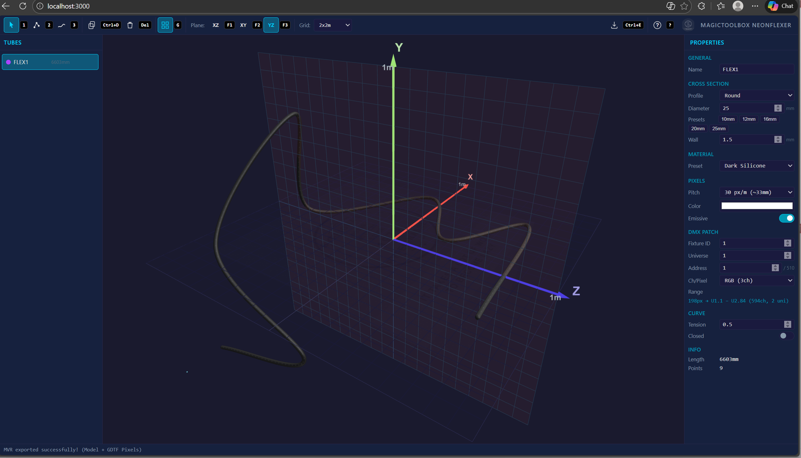

# MAGICTOOLBOX NEONFLEXER — Beta v1.0.0

3D NeonFlex LED tube designer for lighting professionals. Draw tubes in 3D, configure LED pixels, set DMX patch, and export as MVR for direct import into Capture, WYSIWYG, Depence, or any MVR-compatible visualizer.

## Features

- **3D Tube Drawing** — Click-to-place or freehand draw on XZ, XY, or YZ planes
- **Realistic Materials** — PBR silicone materials (Dark, Clear, Milky White, Frosted) with transmission
- **Cross Sections** — Round, square, or rectangular tubes with preset sizes
- **LED Pixel Placement** — Configurable pitch (30, 60, 96, 144 px/m or custom)
- **DMX Patching** — Per-tube fixture ID, universe, address, RGB/RGBW with automatic universe wrapping
- **MVR Export** — Full MVR 1.6 file with GDTF generic LED fixtures and GLB tube models
- **Tube Editing** — Move whole tubes or individual control points, duplicate, delete
- **Multi-Plane Drawing** — Switch planes mid-draw with auto-anchoring
- **Help Overlay** — Press `?` to see all keyboard shortcuts

## Quick Start

### Online (no install)

Open in your browser: **[amonsch1979.github.io/neonflexer](https://amonsch1979.github.io/neonflexer/)**

### Offline (download)

1. **Download** — Click the green **Code** button above → **Download ZIP**
2. **Unzip** anywhere on your computer
3. **Launch:**
   - **Windows:** Double-click `NEONFLEXER.bat`
   - **Mac/Linux:** Double-click `NEONFLEXER.command`
4. The app opens automatically in your browser

> No install required on Windows 10/11 — the launcher uses PowerShell as fallback.

## Keyboard Shortcuts

| Key | Action |
|-----|--------|
| `1` | Select / Move mode |
| `2` | Click Place mode |
| `3` | Freehand Draw mode |
| `Ctrl+D` | Duplicate selected tube |
| `Del` | Delete selected tube or point |
| `G` | Toggle grid snap |
| `F1` `F2` `F3` | Switch drawing plane (XZ / XY / YZ) |
| `Shift+Drag` | Adjust height off-plane |
| `Enter` / `Dbl-Click` | Finish tube |
| `Backspace` | Undo last point |
| `Ctrl+E` | Export MVR |
| `H` | Toggle Y-axis on move gizmo |
| `?` | Help overlay |
| `Esc` | Cancel / close |

## Mouse Controls

| Action | Function |
|--------|----------|
| Left click | Place points (drawing) / Select (select mode) |
| Middle mouse | Orbit camera (always) |
| Right mouse | Pan camera |
| Scroll wheel | Zoom |

## MVR Export

The exported `.mvr` file contains:
- **GeneralSceneDescription.xml** — Scene with layers, grouped model + fixtures per tube
- **GenericLED.gdtf** — Generic RGB/RGBW LED pixel fixture
- **models/TubeModel.glb** — Tube body meshes with PBR materials

Each pixel is exported as a GDTF fixture with correct DMX addressing (absolute, auto-wrapping across universes). Import directly into Capture or any MVR-compatible software.

## Tech Stack

- [Three.js](https://threejs.org/) v0.170 — 3D rendering via CDN
- Pure HTML / CSS / JavaScript — no build tools, no dependencies to install
- Works in Chrome, Firefox, Safari, and Edge on Windows and Mac

## License

MIT License — see [LICENSE](LICENSE)

---

Made by **BYFEIGNASSE** | MAGICTOOLBOX
